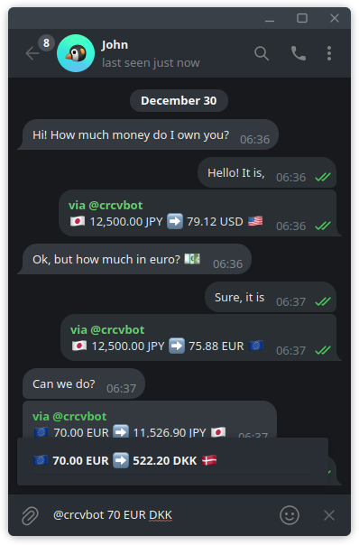

# Currency Converter Bot for Telegram 💸

This is an implementation of an inline currency converter bot for Telegram. You may use it at https://t.me/crcvbot

## Using

To use this bot, type `@crcv` followed by the amount of the current currency, the current currency code, and the desired currency code (`@crcv AMOUNT CURRENCY TARGET`) like this: `@crcv 1000 DKK USD` in any chat. The bot will then display the result as a message appearing to come from you. For example, converting 1000 DKK (Danish Krone) to USD (United States Dollars) will show up directly in the chat like this:

## FAQ

- It does not support cryptocurrencies.
- It is free and only displays currency conversion, it does not transfer any money.
